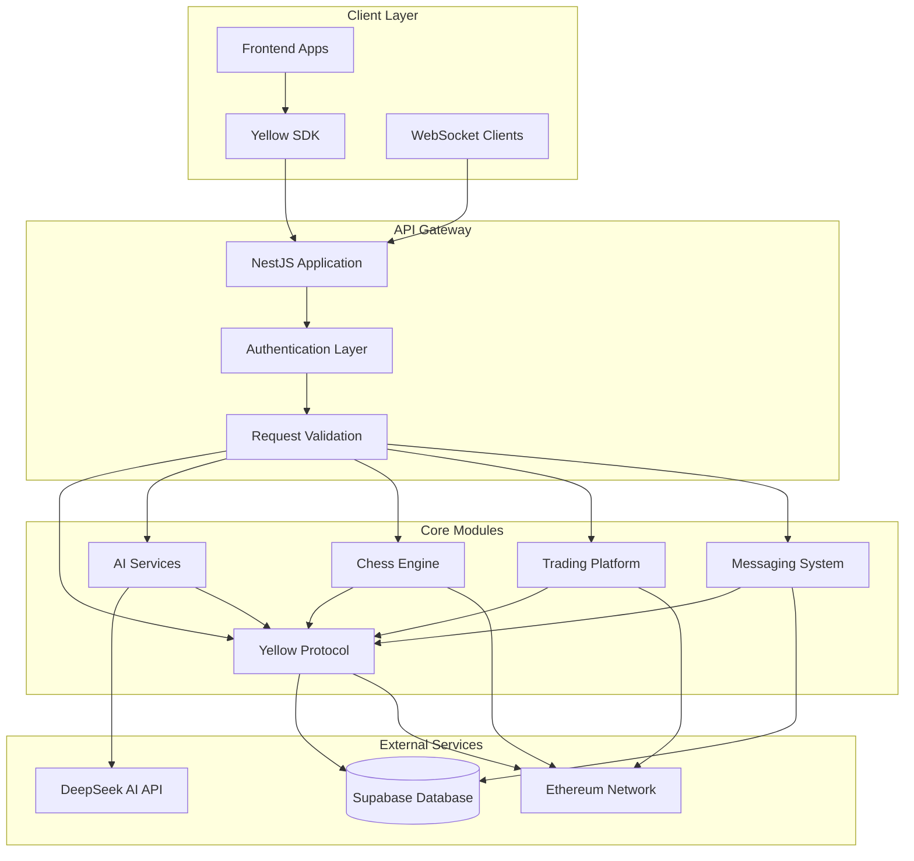
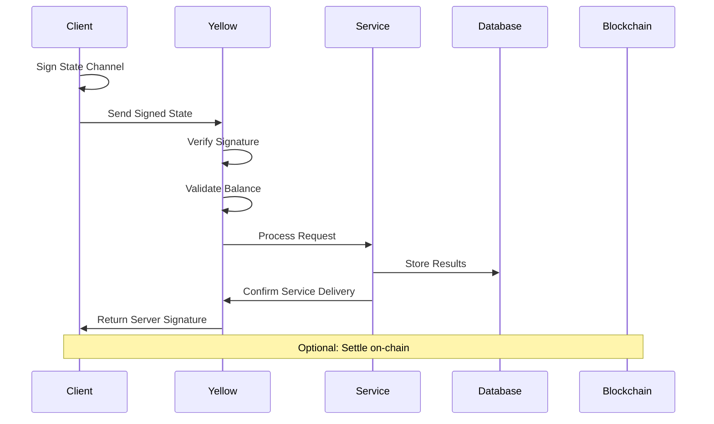
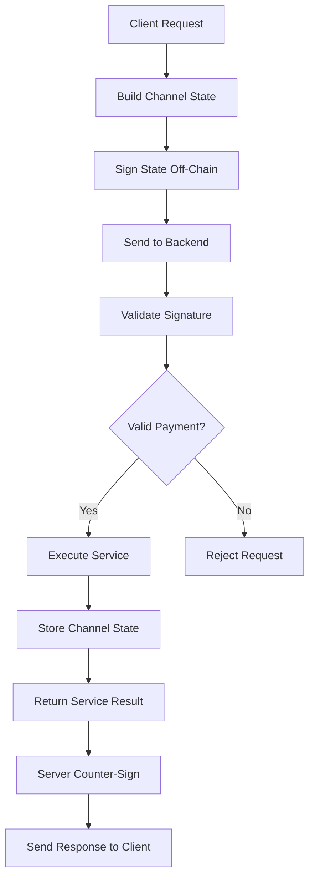
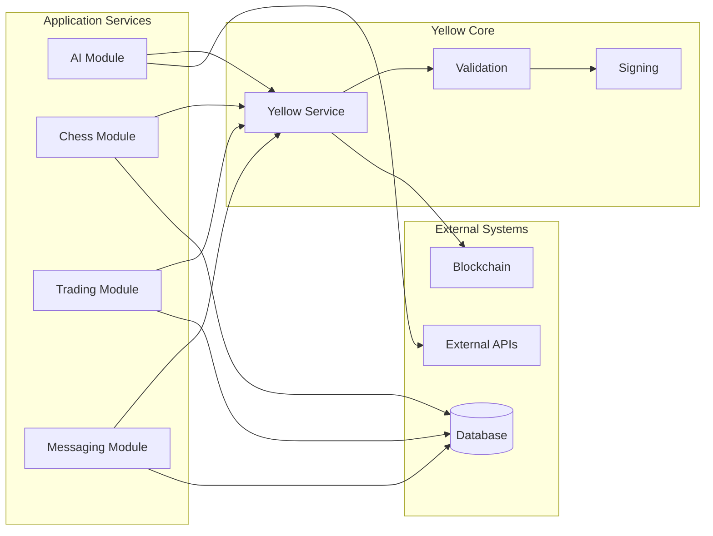

# Distributed Gaming & DeFi Protocol - Technical Documentation

## Table of Contents
1. [System Overview](#system-overview)
2. [System Architecture](#system-architecture)  
3. [Module Documentation](#module-documentation)
4. [API Endpoints](#api-endpoints)
5. [Data Flow Diagrams](#data-flow-diagrams)
6. [Technical Implementation](#technical-implementation)

---

## System Overview

This NestJS-based project implements a **distributed gaming and DeFi protocol** that combines multiple blockchain-based services through a unified micropayment system called **Yellow**. The platform supports chess gaming, AI services, decentralized trading, and real-time messaging, all powered by off-chain state channels for instant, low-cost transactions.

### Key Features
- **Yellow Protocol**: Off-chain micropayment system using state channels
- **Chess Engine**: Blockchain-verified chess gaming with wagering
- **AI Services**: On-demand AI inference with per-query payments
- **Trading Platform**: Decentralized trading with orderbooks and positions
- **Real-time Messaging**: Paid messaging system with delivery guarantees
- **Database Integration**: Supabase for persistent state management

### Technology Stack
- **Backend**: NestJS, TypeScript, WebSocket Gateway
- **Blockchain**: Ethers.js, ECDSA signature verification
- **Database**: Supabase (PostgreSQL)
- **AI Integration**: DeepSeek API
- **Real-time**: WebSocket connections for live updates

---

## System Architecture

### High-Level Architecture


### Payment Flow Architecture


---

## Module Documentation

### 1. Yellow Module - Micropayment Protocol

**Location**: `src/Yellow/`
**Purpose**: Core micropayment system using off-chain state channels

#### Features
- **State Channel Management**: Off-chain balance tracking
- **Signature Verification**: ECDSA signature validation
- **Deterministic Messaging**: Consistent state serialization  
- **Double Signing**: User + Server signature confirmation
- **Balance Validation**: Ensures sufficient funds and nonce progression

#### Key Classes

**YellowService** (`yellow.service.ts`)
```typescript
class YellowService {
  // Core payment validation
  async validateAndSignState(state: any, amountToPay: bigint): Promise<string>
  
  // Message signing for server confirmation
  async signMessage(message: string | Uint8Array): Promise<string>
  
  // Get server wallet address
  getServerAddress(): string
}
```

**Data Transfer Objects** (`yellow.dto.ts`)
- `ChannelState`: Represents off-chain payment state
- `AIRequestDto`: AI service request with payment
- `AIResponseDto`: AI service response with server signature

#### Payment Protocol
1. **State Construction**: Client builds channel state with balances
2. **Message Creation**: Deterministic string format `CHANNEL:id|NONCE:n|UBAL:u|SBAL:s`
3. **Client Signing**: User signs state with private key
4. **Server Validation**: Backend verifies signature and balance logic
5. **Service Execution**: Process request after payment confirmation
6. **Server Confirmation**: Backend counter-signs new state

---

### 2. AI Module - Artificial Intelligence Services

**Location**: `src/AI/`
**Purpose**: On-demand AI inference with micropayment integration

#### Features
- **DeepSeek Integration**: External AI API connectivity
- **Pay-per-Query**: 0.1 USDC per AI request
- **Fallback System**: Simulated responses if API fails
- **State Validation**: Uses Yellow protocol for payment verification

#### Key Classes

**AIService** (`ai.service.ts`)
```typescript
class AIService {
  private readonly INFERENCE_COST = 100000n; // 0.1 USDC (6 decimals)
  
  // Main entry point for paid AI requests
  async processInference(request: AIRequestDto): Promise<AIResponseDto>
  
  // External AI API integration
  private async callDeepSeek(prompt: string): Promise<string>
  
  // Fallback simulation
  private simulateAI(prompt: string): string
}
```

**AIController** (`ai.controller.ts`)
- `GET /ai/status`: Service health and pricing information
- `POST /ai/inference`: Process AI request with payment verification

#### Business Logic Flow
1. **Payment Validation**: Yellow service verifies off-chain payment
2. **API Call**: Execute DeepSeek AI API request
3. **Fallback Handling**: Use simulation if external API fails
4. **Response Generation**: Return AI result + server payment confirmation

---

### 3. Chess Module - Blockchain Chess Gaming

**Location**: `src/Chess/`
**Purpose**: Multiplayer chess with on-chain verification and wagering

#### Features
- **Chess Engine**: Complete chess.js integration
- **Wagering System**: Token-based game betting
- **Move Verification**: Cryptographic signature validation
- **Game State Management**: In-memory active game tracking
- **Blockchain Integration**: On-chain settlement capabilities

#### Key Classes

**ChessService** (`chess.service.ts`)
```typescript
class ChessService {
  // In-memory game state storage
  private activeGames: Map<string, ChessGame> = new Map()
  private gameChannels: Map<string, GameChannel> = new Map()
  
  // Game lifecycle management
  async startGame(dto: StartGameDto): Promise<GameStartResponse>
  async makeMove(dto: MakeMoveDto): Promise<MoveResponse>
  async claimVictory(dto: ClaimVictoryDto): Promise<any>
}
```

**ChessGateway** (`chess.gateway.ts`)
- **WebSocket Events**: Real-time game updates
- **Room Management**: Player join/leave handling
- **Move Broadcasting**: Live move notifications

#### Game Flow
1. **Game Initialization**: Player creates game with wager signature
2. **Player Matching**: Second player joins with matching wager
3. **Move Execution**: Players submit signed moves
4. **State Validation**: Chess.js engine validates legal moves
5. **Result Settlement**: Winner claims victory through smart contract

---

### 4. Trading Module - Decentralized Exchange

**Location**: `src/Trading/`
**Purpose**: Complete DEX implementation with orderbooks and margin trading

#### Features
- **Orderbook Management**: Buy/sell order matching
- **Position Tracking**: Leverage and margin calculations
- **Price Feeds**: Real-time market data integration
- **Liquidation Engine**: Automated position liquidation
- **Signature Verification**: All actions cryptographically signed

#### Key Services

**TradingService** (`trading.service.ts`)
- Central orchestrator for all trading operations
- Order creation, cancellation, and execution
- Position management and margin handling

**OrderbookService** (`services/orderbook.service.ts`)
- Order matching engine
- Market depth calculation
- Trade execution logic

**PositionService** (`services/position.service.ts`)
- Leverage position management
- Margin requirement calculations
- PnL tracking and updates

**LiquidationService** (`services/liquidation.service.ts`)
- Automated liquidation monitoring
- Risk assessment algorithms
- Force position closure

**PriceFeedService** (`services/price-feed.service.ts`)
- External price data integration
- Market data normalization
- Real-time price updates

#### Trading Flow
1. **Order Creation**: Trader submits signed order
2. **Signature Verification**: Validate order authenticity
3. **Orderbook Matching**: Find opposing orders
4. **Trade Execution**: Execute matched orders
5. **Position Updates**: Update trader balances and positions
6. **Risk Assessment**: Monitor for liquidation conditions

---

### 5. Messaging Module - Paid Messaging System

**Location**: `src/Messaging/`
**Purpose**: Micropayment-based messaging with delivery guarantees

#### Features
- **Pay-per-Message**: 0.0001 USDC per message
- **State Channel Integration**: Uses Yellow for payments
- **Database Persistence**: Message storage and delivery tracking
- **Real-time Delivery**: WebSocket-based live messaging
- **Read Receipts**: Message status tracking

#### Key Classes

**MessagingService** (`messaging.service.ts`)
```typescript
class MessagingService {
  private readonly MESSAGE_PRICE_USDC = ethers.parseUnits("0.0001", 6)
  
  // Main message processing with payment
  async processMessage(sender: string, dto: SendMessageDto)
  
  // Message retrieval and management
  async getConversation(userA: string, userB: string): Promise<ChatMessage[]>
  async markMessageAsRead(messageId: string, userId: string): Promise<boolean>
}
```

**MessagingGateway** (`messaging.gateway.ts`)
- **WebSocket Events**: Real-time message delivery
- **Connection Management**: User session handling
- **Message Broadcasting**: Live message notifications

#### Messaging Flow
1. **Message Creation**: User drafts message with payment state
2. **Payment Validation**: Yellow verifies micropayment
3. **Database Storage**: Persist message and channel state
4. **Real-time Delivery**: WebSocket broadcast to recipient
5. **Delivery Confirmation**: Update message status and read receipts

---

### 6. Supabase Module - Database Integration

**Location**: `src/supabase/`
**Purpose**: PostgreSQL database connectivity and state management

#### Features
- **Client Initialization**: Supabase client configuration
- **Environment Configuration**: Secure credential management
- **Global Service**: Shared database access across modules

#### Key Classes

**SupabaseService** (`supabase.service.ts`)
```typescript
class SupabaseService {
  private supabase: SupabaseClient
  
  // Get configured database client
  getClient(): SupabaseClient
}
```

#### Database Schema
- **payment_channels**: State channel persistence
- **chess_games**: Game state and history
- **messages**: Chat message storage
- **trades**: Trading transaction history
- **positions**: Trading position tracking

---

## API Endpoints

### AI Services
```http
GET  /ai/status          # Service health check
POST /ai/inference       # AI request with payment
```

### Chess Gaming
```http
POST /chess/start        # Initialize new game
POST /chess/move         # Submit chess move  
POST /chess/claim        # Claim game victory
GET  /chess/game/:id     # Get game state
```

### Trading Platform
```http
POST /trading/order      # Create trading order
POST /trading/cancel     # Cancel existing order
POST /trading/position   # Update position
GET  /trading/orderbook  # Get market depth
GET  /trading/positions  # Get user positions
```

### Messaging System
```http
POST /messaging/send     # Send paid message
GET  /messaging/conversation/:user  # Get chat history
POST /messaging/read     # Mark message as read
```

---

## API Request Examples

### AI Service Requests

#### Get AI Service Status
```bash
curl -X GET http://localhost:3000/ai/status
```

**Response:**
```json
{
  "status": "AI Service is Online",
  "cost": "0.1 USDC"
}
```

#### Request AI Inference with Payment
```bash
curl -X POST http://localhost:3000/ai/inference \
  -H "Content-Type: application/json" \
  -d '{
    "prompt": "Analyze the current market conditions for ETH/USDC",
    "signedState": {
      "channelId": "0xCH_a1b2c3d4",
      "nonce": 1706889600000,
      "userAddress": "0x742d35Cc1234567890abcdef1234567890abcdef",
      "serverAddress": "0xServer123456789abcdef1234567890abcdef123",
      "userBalance": "10000000",
      "serverBalance": "500000", 
      "signature": "0x1b2c3d4e5f6789abcdef1234567890abcdef1234567890abcdef1234567890abcdef1234567890abcdef1234567890abcdef1c"
    }
  }'
```

**Response:**
```json
{
  "result": "[YellowAI]: El mercado parece alcista basado en los últimos bloques.",
  "newServerSignature": "0x9876543210fedcba9876543210fedcba9876543210fedcba9876543210fedcba9876543210fedcba9876543210fedcba1c"
}
```

### Chess Game Requests

#### Start New Chess Game
```bash
curl -X POST http://localhost:3000/chess/start \
  -H "Content-Type: application/json" \
  -d '{
    "walletAddress": "0x742d35Cc1234567890abcdef1234567890abcdef",
    "wagerAmount": "1000000",
    "signature": "0x1b2c3d4e5f6789abcdef1234567890abcdef1234567890abcdef1234567890abcdef1234567890abcdef1234567890abcdef1c"
  }'
```

**Response:**
```json
{
  "gameId": "game_1706889600123",
  "status": "waiting_for_opponent",
  "fen": "rnbqkbnr/pppppppp/8/8/8/8/PPPPPPPP/RNBQKBNR w KQkq - 0 1",
  "wagerAmount": "1000000",
  "player1": {
    "address": "0x742d35Cc1234567890abcdef1234567890abcdef",
    "color": "white"
  }
}
```

#### Make Chess Move
```bash
curl -X POST http://localhost:3000/chess/move \
  -H "Content-Type: application/json" \
  -d '{
    "gameId": "game_1706889600123",
    "from": "e2",
    "to": "e4",
    "player": "0x742d35Cc1234567890abcdef1234567890abcdef",
    "signature": "0x2c3d4e5f6789abcdef1234567890abcdef1234567890abcdef1234567890abcdef1234567890abcdef1234567890abcdef2c"
  }'
```

**Response:**
```json
{
  "gameId": "game_1706889600123",
  "move": {
    "from": "e2",
    "to": "e4",
    "san": "e4",
    "piece": "p"
  },
  "newFen": "rnbqkbnr/pppppppp/8/8/4P3/8/PPPP1PPP/RNBQKBNR b KQkq e3 0 1",
  "gameStatus": "active",
  "isCheck": false,
  "isCheckmate": false
}
```

#### Get Game State
```bash
curl -X GET http://localhost:3000/chess/game/game_1706889600123
```

**Response:**
```json
{
  "gameId": "game_1706889600123",
  "status": "active",
  "currentTurn": "black",
  "fen": "rnbqkbnr/pppppppp/8/8/4P3/8/PPPP1PPP/RNBQKBNR b KQkq e3 0 1",
  "moveHistory": [
    {
      "from": "e2",
      "to": "e4",
      "san": "e4",
      "timestamp": 1706889660000
    }
  ],
  "players": {
    "white": "0x742d35Cc1234567890abcdef1234567890abcdef",
    "black": "0x853e46Dd2345678901bcdef2345678901bcdef2"
  },
  "wagerAmount": "1000000"
}
```

### Trading Platform Requests

#### Create Trading Order
```bash
curl -X POST http://localhost:3000/trading/order \
  -H "Content-Type: application/json" \
  -d '{
    "trader": "0x742d35Cc1234567890abcdef1234567890abcdef",
    "market": "ETH_USDC", 
    "side": "buy",
    "size": "1.5",
    "price": "2500.00",
    "leverage": 2,
    "signature": "0x3d4e5f6789abcdef1234567890abcdef1234567890abcdef1234567890abcdef1234567890abcdef1234567890abcdef3d"
  }'
```

**Response:**
```json
{
  "order": {
    "id": "order_1706889700456",
    "trader": "0x742d35Cc1234567890abcdef1234567890abcdef",
    "market": "ETH_USDC",
    "side": "buy", 
    "size": "1.5",
    "price": "2500.00",
    "leverage": 2,
    "status": "open",
    "createdAt": 1706889700456
  },
  "trades": [
    {
      "id": "trade_1706889700457",
      "buyOrderId": "order_1706889700456",
      "sellOrderId": "order_1706889650123",
      "price": "2500.00",
      "size": "0.8",
      "executedAt": 1706889700457
    }
  ]
}
```

#### Get Orderbook
```bash
curl -X GET http://localhost:3000/trading/orderbook?market=ETH_USDC
```

**Response:**
```json
{
  "market": "ETH_USDC",
  "timestamp": 1706889750000,
  "bids": [
    {
      "price": "2499.50",
      "size": "2.3",
      "total": "5748.85"
    },
    {
      "price": "2499.00", 
      "size": "1.8",
      "total": "4498.20"
    }
  ],
  "asks": [
    {
      "price": "2500.50",
      "size": "1.9",
      "total": "4750.95"
    },
    {
      "price": "2501.00",
      "size": "2.1", 
      "total": "5252.10"
    }
  ]
}
```

#### Get User Positions
```bash
curl -X GET "http://localhost:3000/trading/positions?trader=0x742d35Cc1234567890abcdef1234567890abcdef"
```

**Response:**
```json
{
  "positions": [
    {
      "id": "pos_1706889800789",
      "trader": "0x742d35Cc1234567890abcdef1234567890abcdef",
      "market": "ETH_USDC",
      "side": "long",
      "size": "2.5",
      "entryPrice": "2500.00",
      "currentPrice": "2520.00",
      "leverage": 3,
      "margin": "2083.33",
      "unrealizedPnL": "50.00",
      "liquidationPrice": "1875.00",
      "status": "open"
    }
  ]
}
```

### Messaging System Requests

#### Send Paid Message
```bash
curl -X POST http://localhost:3000/messaging/send \
  -H "Content-Type: application/json" \
  -d '{
    "to": "0x853e46Dd2345678901bcdef2345678901bcdef2",
    "content": "Hey! Want to play chess? Wager: 1 USDC",
    "channelState": {
      "channelId": "0xCH_msg_123456",
      "nonce": 1706889850000,
      "userAddress": "0x742d35Cc1234567890abcdef1234567890abcdef", 
      "serverAddress": "0xServer123456789abcdef1234567890abcdef123",
      "userBalance": "999900",
      "serverBalance": "100",
      "signature": "0x4e5f6789abcdef1234567890abcdef1234567890abcdef1234567890abcdef1234567890abcdef1234567890abcdef4e"
    }
  }'
```

**Response:**
```json
{
  "messageId": "msg_1706889850123",
  "status": "sent",
  "timestamp": 1706889850123,
  "cost": "100",
  "serverSignature": "0xa876543210fedcba9876543210fedcba9876543210fedcba9876543210fedcba9876543210fedcba9876543210fedcaa"
}
```

#### Get Conversation History
```bash
curl -X GET "http://localhost:3000/messaging/conversation/0x853e46Dd2345678901bcdef2345678901bcdef2"
```

**Response:**
```json
{
  "conversation": [
    {
      "id": "msg_1706889850123",
      "from": "0x742d35Cc1234567890abcdef1234567890abcdef",
      "to": "0x853e46Dd2345678901bcdef2345678901bcdef2", 
      "content": "Hey! Want to play chess? Wager: 1 USDC",
      "timestamp": 1706889850123,
      "is_read": false
    },
    {
      "id": "msg_1706889900456",
      "from": "0x853e46Dd2345678901bcdef2345678901bcdef2",
      "to": "0x742d35Cc1234567890abcdef1234567890abcdef",
      "content": "Sure! Let's play. I accept the wager.",
      "timestamp": 1706889900456,
      "is_read": true
    }
  ]
}
```

#### Mark Message as Read
```bash
curl -X POST http://localhost:3000/messaging/read \
  -H "Content-Type: application/json" \
  -d '{
    "messageId": "msg_1706889850123"
  }'
```

**Response:**
```json
{
  "messageId": "msg_1706889850123",
  "status": "read",
  "updatedAt": 1706889950000
}
```

### Yellow Protocol Integration Notes

#### Signature Generation (Frontend)
```javascript
// Example of how the frontend SDK generates signatures
const messageContent = `CHANNEL:${channelId}|NONCE:${nonce}|UBAL:${userBalance}|SBAL:${serverBalance}`;
const signature = await account.signMessage({ message: messageContent });
```

#### State Channel Management
All payment-enabled endpoints require a valid `channelState` object with:
- `channelId`: Unique identifier for the payment channel
- `nonce`: Incrementing counter to prevent replay attacks
- `userAddress`: Client's wallet address  
- `serverAddress`: Backend service wallet address
- `userBalance`: Remaining balance after payment (in wei/units)
- `serverBalance`: Service provider's balance after payment
- `signature`: ECDSA signature of the deterministic message

#### Error Handling
```json
// Invalid signature error
{
  "statusCode": 400,
  "message": "Invalid signature: No coincide con la dirección del usuario",
  "error": "Bad Request"
}

// Insufficient balance error  
{
  "statusCode": 400,
  "message": "Insufficient balance for this operation",
  "error": "Bad Request"
}

// Service unavailable error
{
  "statusCode": 503,
  "message": "External service temporarily unavailable", 
  "error": "Service Unavailable"
}
```

---

## Data Flow Diagrams

### Yellow Protocol Payment Flow


### Multi-Service Integration


---

## Technical Implementation

### Environment Configuration
```bash
# Blockchain Configuration
PRIVATE_KEY=0x...                    # Server wallet private key
RPC_URL=https://...                  # Ethereum RPC endpoint

# Database Configuration  
SUPABASE_URL=https://...             # Supabase project URL
SUPABASE_SERVICE_ROLE_KEY=...        # Database access key

# External API Keys
DEEPSEEK_API_KEY=...                 # AI service API key

# Application Settings
PORT=3000                            # Server port
NODE_ENV=development                 # Environment mode
```

### Security Considerations

**Signature Verification**
- All transactions require ECDSA signature validation
- Deterministic message construction prevents replay attacks
- Server-side signature verification ensures authenticity

**State Channel Security**
- Nonce progression prevents double-spending
- Balance validation ensures sufficient funds
- Off-chain settlement reduces gas costs

**Database Security**
- Parameterized queries prevent SQL injection
- Service role key access for backend operations
- Channel state persistence prevents fund loss

### Performance Optimizations

**In-Memory Storage**
- Active game states cached for fast access
- WebSocket connections maintained for real-time updates
- Orderbook data structures optimized for matching

**Asynchronous Processing**
- Non-blocking I/O for external API calls
- Promise-based service integration
- Concurrent request handling

**Database Optimization**
- Indexed queries for fast lookups
- Batch operations for bulk updates
- Connection pooling for scalability

---

## Development & Deployment

### Local Development
```bash
# Install dependencies
npm install

# Configure environment
cp .env.example .env

# Start development server
npm run start:dev

# Run tests
npm run test
```

### Production Deployment
```bash
# Build application
npm run build

# Start production server
npm run start:prod

# Database migrations
npm run migration:run
```

### Monitoring & Logging
- Structured logging with Winston
- Performance metrics collection
- Error tracking and alerting
- Database query monitoring

---

This documentation provides a comprehensive overview of the distributed gaming and DeFi protocol. Each module is designed for modularity, scalability, and seamless integration with the Yellow micropayment system, enabling a new generation of blockchain-based applications with instant, low-cost transactions.